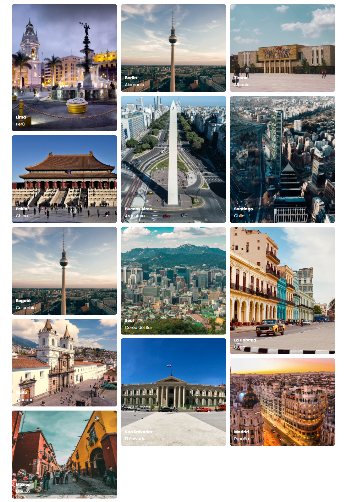
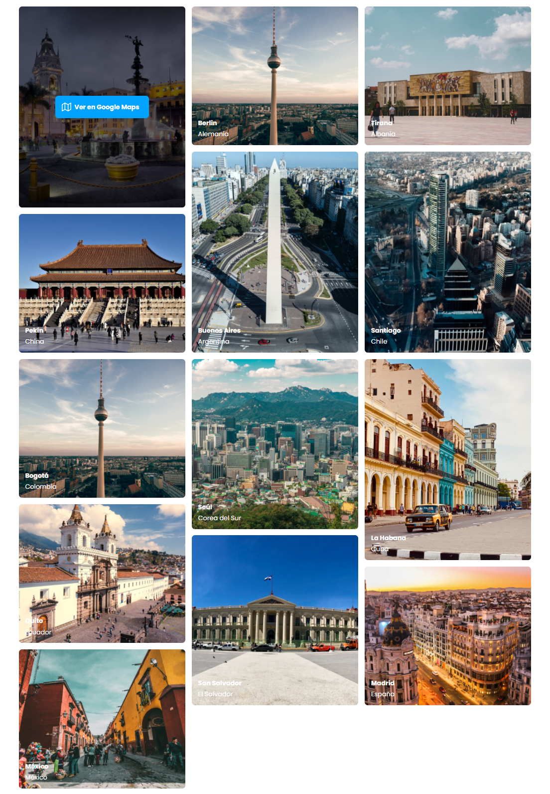
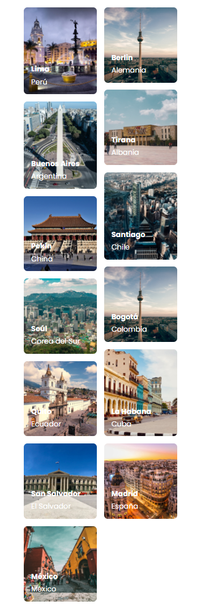

# Grid Gallery

Practica tus habilidades de Grid CSS con este ejercicio de las capitales del mundo.

##Requerimientos
- Accesibilidad como prioridad
- Aplicar resposive design
- Añadir button para ir a google maps de cada capital
- Sube tu código a GitHub
- Publica tu resultado con github pages
- Mándalo a revisión desde tu [perfil](https://leonidasesteban.com/estudiante)

## Desktop

  <table>
    <tr>
        <td style="text-align:center">
            
        </td>
        <td style="text-align:center">           
            
        </td>
    </tr>
  </table>

## Mobile

## Disclaimer

Todas son propuestas, el propósito de **/Proyectos** es brindarte el diseño, el límite de la creación lo dictan tus ganas de hacerlo realidad y tu skills del momento a la hora de codear.

## Créditos

Encuentra más proyectos asombrosos en [/Proyectos](https://leonidasesteban.com/proyectos)

Diseñado con ♥️ en leonidasesteban.com